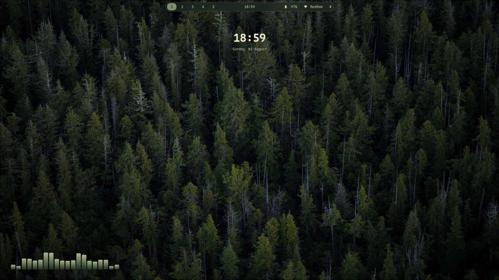
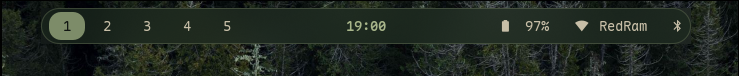
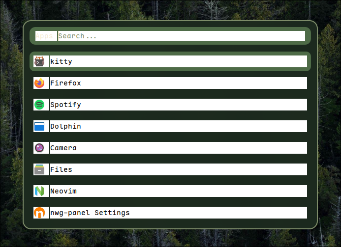
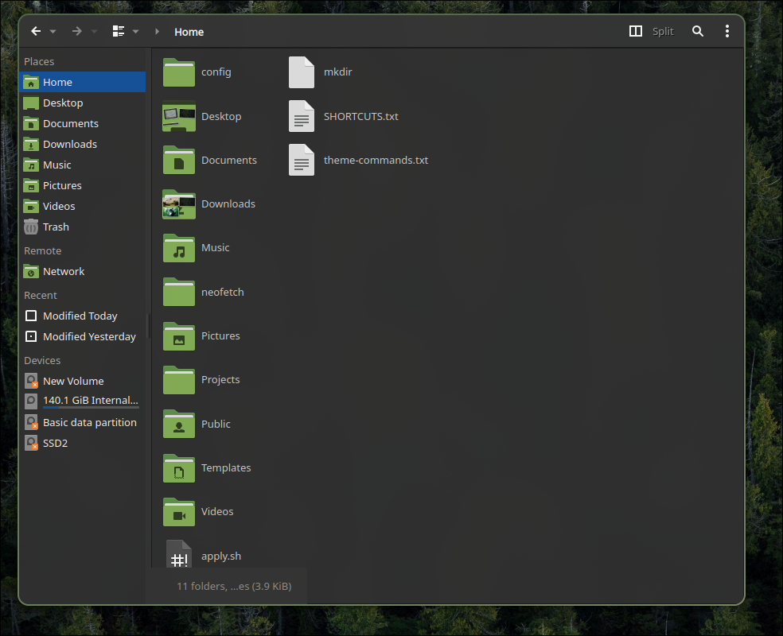

# musashi

A clean, modular Hyprland rice for Fedora Linux — minimal, dark, and
nature-inspired, with a switchable theme system.


## Themes

- **Vagabond** (default) — dark green / olive, inspired by the Vagabond manga
- **Lain** — dark cyberpunk teal/blue
- **Evangelion** — NERV purple with orange accents
- **Nature** — warmer, brighter green

Switch anytime with:
```bash
./scripts/theme-switch.sh <vagabond|lain|evangelion|nature>
```

## Components

| Component     | Tool        |
|---------------|-------------|
| Compositor    | Hyprland    |
| Bar           | Waybar (floating "island" style) |
| Launcher      | Rofi        |
| Terminal      | Kitty       |
| Lock screen   | Hyprlock (live blurred screenshot background) |
| Idle daemon   | Hypridle    |
| Notifications | SwayNC      |
| Wallpaper     | Hyprpaper   |
| Qt theming    | qt6ct + Kvantum |
| File manager  | Dolphin + Papirus-Dark icons |

## Installation

See [docs/installation.md](docs/installation.md) for full setup instructions,
including the COPR repository needed for `hyprpaper`.

```bash
git clone git@github.com:yehia-mg/musashi.git
cd musashi
./install.sh
./apply.sh
./scripts/theme-switch.sh vagabond
```

## Keybindings

See [docs/keybindings.md](docs/keybindings.md) for the full reference.


### Desktop



### Waybar (floating island)



### Rofi launcher



### Dolphin file manager



_Coming soon._

## License

MIT — see [LICENSE](LICENSE).
